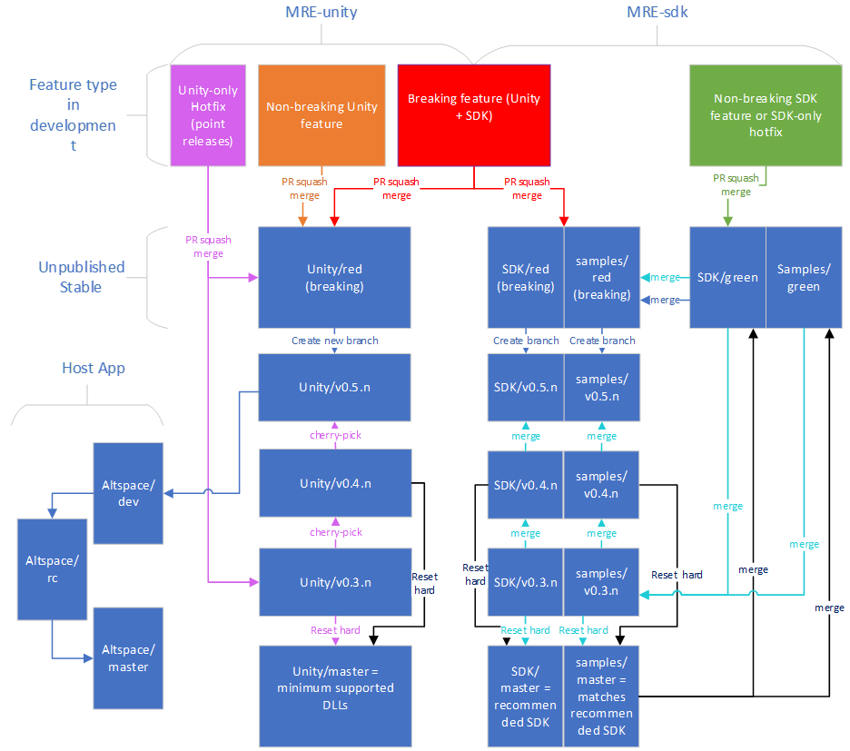

# MRE SDK Workflow and Branching Guide

## Motivation for branch system revision
* minimize the number of custom branch names and purposes, to 3 branches for all non-hotfix commits (2 in SDK, 1 in Unity)
* remove unnecessary overhead caused by matching AltspaceVR branch changes and releases
* create a consistent hotfix strategy

## Repos and Branches
* There are 3 interconnected github repos (in this document named unity, sdk and samples). They all have matching branch names (except there is no unity/green – non-breaking features go into the red branch) 
* */red and */green = active development. Green=safe to go out with little-to-no warning. Red=complex/has dependencies/tied to a major release.
* */r0.[minor].n = release branches – new branches are created when a new release is initiated (not just when we are ready to publish the DLLs+NPM packages)
* */master = branch pointers to minimum supported DLL (typically AltspaceVR's shipped version) and recommended SDK. This is not used for MRE development, and nothing is ever committed to the master branches directly.

## Recommended branch usage
* use unity/master+sdk/master (or sdk/green) for quick tests/debugging released MREs.
* use unity/master(or altspacevr retail build)+sdk/green for minor node fixes/hotfixes
* use unity/red+sdk/red for general development.

## Misc. Notes

(Once we guarantee back compatibility, Unity/master should point to the newest releases sdk, and sdk/master should point to minimum supported version - we want implementers to use the freshest dll, but MRE creators to make MREs that run on every host app). But due to back compat, for now unity/master will point to a version compatible with sdk/master

Minimum supported version=the major.minor version that all host apps support, and have force updated their users to.

Minor version number doesn't have to increment in lockstep with altspace's release cycle. We may do more than 1 sdk release between altspace releases.

With this structure, I'd expect there to mostly be 1 or 2 active release versions, but occasionally there would be 3 (or in theory more). The diagram cover 3 active versions for comprehension

## Main workflows:
### [Orange] Integrate minor unity-only change
1. [Develop feature](#Develop-feature) targeting unity/red

### [Green] integrate node-only change (or hotfix)
1. [Develop feature](#Develop-feature) targeting sdk/green, samples/green

### [Red] integrate breaking unity+node change
1. [Develop feature](#Develop-feature) targeting unity/red, sdk/red, samples/red

### [Blue] When we decide to prepare a new MRE minor version release (criteria: usually ~1 day before Altspace code lock, or sooner if there are major changes)
1. Merge sdk/green into sdk/red
2. Merge samples/green into samples/red
3. Update CurrentVersion to match major.minor in MREUnityRuntime\MREUnityRuntimeLib\Constants.cs and 
4. If new features were added to SDK, increase MinimumSupportedClientVersion packages\sdk\src\utils\verifyClient.ts 
5. If communication was changed in a non-backwards-compatible way, which is a HUGE DEAL, should never happen after exiting beta stage, and requires full team sign-off, increase the MinimumSupportedSDKVersion in MREUnityRuntimeLib\Constants.cs 
6. [Test pass](#Test-pass) for red branches
7. Create new unity+sdk+sample branches named v0.[new_minor].n, matching the red (NOTE: if there was already a new SDK release created, but it wasn't "shipped", we can stomp that - i.e. if v0.[new_minor-1].n was never used in any host app, we can just reset hard, instead of creating v0.[new_minor].n)
8. [Build Unity DLLs](#Build-Unity-DLLs) from unity/v0.[new_minor].n
9. [Publish NPM packages](#Publish-NPM-packages) from sdk/v0.[new_minor].n

### [Cyan] When we decide to integrate sdk/green, to patch/hotfix a minor version (The targeted minor version is usually whatever master points to. Criteria: whenever we think it's worth the effort)
1. Merge sdk/green into v0.[target].n 
2. Merge samples/green into v0.[target].n 
3. [Test pass](#Test-pass) for v0.[target].n branches
4. [Publish NPM packages](#Publish-NPM-packages) from v0.[target].n
5. If target is current master version
   1. [Update Master branches](#Update-Master-branches) for sdk+samples
6. If branches for (target+1) exists
   1. Merge sdk/v0.[target].n into v0.[target+1].n 
   2. Merge samples/v0.[target].n into v0.[target+1].n 
   3. Repeat steps 3-6 with target = target+1
7. Merge sdk/green into red
8. Merge samples/green into red
9. [Test pass](#Test-pass) for red branches

### [Purple] When we need to do a unity-side hotfix in any target release
1. [Develop feature](#Develop-feature) targeting the unity/v0.[target].n branch. 
2. [Build Unity DLLs](#Build-Unity-DLLs) from unity/r0.[target].n
3. If target is current master version
   1. [Update Master branches](#Update-Master-branches) for Unity
4. If branches for (targetversion+1) exists
   1. Cherry pick hotfix from unity/r0.[target].n to r0.[targetversion+1].n, 
   2. Repeat steps 2-3 with target=target+1
5. Merge cherry pick hotfix to unity/red
6. [Test pass](#Test-pass) for red branches

### [Black] When we update the minimum supported version (i.e. just after Altspace releases)
1. [Update Master branches](#Update-Master-branches) for all repositories
2. Merge sdk/v0.[new_minor].n to green
3. Merge samples/v0.[new_minor].n to green
4. [Test pass](#Test-pass) for green branches

### When Altspace creates RC
1. Do nothing – MRE release cycle is decoupled from Altspace RC cycle.
 
## Detailed Workflows

### Develop Feature
1. Create Branch [username]/[featurename] (or feature/[featurename], bug/[bugname] or hotfix/[hotfixname] from a target branch, for all relevant repos (sdk+unity+samples)
2. go to [the MRE Github Roadmap page](https://github.com/Microsoft/mixed-reality-extension-sdk/projects/1) and add any issues to the board, and mark as In Progress
3. Write code, commit to branch, push to orign
4. Ensure your feature has test coverage in the functional-test app, and add if necessary
5. [Test pass](#Test-pass) for the branch
6. Do PR towards target branch, with nice description.
7. If failure or revisions, go to step 2
8. When PR is approved for all relevant repos (sdk+unity+samples), do the PR squash merge for all repos simultaneously.
9. go to [the MRE Github Roadmap page](https://github.com/Microsoft/mixed-reality-extension-sdk/projects/1) and move related issues to Fixed

### Test Pass
Main purpose of test pass is to look for regressions – not if new features work properly. **TODO: Add more tests as needed**

1. Run all functional tests.
   1. Test localhost deploy functional tests
      1. Run functional test scene in unity test bed
      2. using the functional test menu in synchronization scene in testbed. Go in and out of each test twice. Keep an eye on the synchronized instance and make sure both work
2. Deploy functional test temporarily to openode/Heroku/azure/ngrok and test 
3. Verify functional tests runs on Android.
4. Run all samples
   1. See instructions for [how to build sample MREs against local NPM package instead of published](https://github.com/Microsoft/mixed-reality-extension-sdk-samples/blob/master/DEVELOPER.md)
5. If problems are found, fix and restart test pass

### Publish NPM Packages
Note that we always publish all packages with each release, with version numbers in sync. Step 1-10 by MREBuildAndDeployNPM script. Step 11 automated by MREBuildSamplesWithNewNPM script.

1. Check out sdk\v0.[minor].n 
2. Git reset –hard
3. git clean -fdx
4. npm install
5. npm run build
6. lerna publish --npm-tag next --force-publish *
   1. when it asks for version number, use 0.[minor].[patch], where minor comes from branch, and patch version is 1+the last published NPM package for that minor version (to find last published version see [MRE version page on NPMJS](https://www.npmjs.com/package/@microsoft/mixed-reality-extension-sdk?activeTab=versions)
7. For each updated package.json version number, notepad-update the version number in every corresponding package-lock.json in the sdk repo. Lerna doesn’t do this (but should) - however, if you do git clean -fdx, git reset --hard, and npm install then this package-lock.json will be updated.
8. Git commit all package-lock.json files to sdk\v0.[minor].n
9. npm run build-docs (to regenerate documentation)
10. commit documentation changes to sdk\v0.[minor].n
11. in samples\v0.[minor].n, for each of the samples update the patch version:
    1. npm update @microsoft/mixed-reality-extension-sdk@0.[minor].[patch]
    2. npm install
    3. npm run build
    3. npm run lint
    4. verify it works
    5. git commit package.json and package-lock.json changes to samples\v0.[minor].n

### Update Master Branches
Step 2 is automated by MREOpenodeDeploy Script. Step 3-6 automated by MREUpdateMasterBranches script
1. Gather the differences from each repo (useful for announcmenets): git log --no-merges --pretty=format:"%s" origin/master..origin/unity/v0.[minor].n
2. redeploy samples and functional test MREs
3. Re-tag the latest NPM package from sdk/v0.[new_minor].n with @latest instead of @next
   1. npm dist-tag add <pkg> @latest
   2. npm dist-tag rm <pkg> @next
4. git reset hard sdk/master to v0.[minor].n
5. git reset hard samples/master to v0.[minor].n
6. git reset hard unity/master to v0.[minor].n
7. In [the github releases page](https://github.com/Microsoft/mixed-reality-extension-sdk/releases), click the latest tag, edit tag, add patch notes.
8. Slack: Make announcement to #announcements channel, share announcement on #general channel.
9. Twitter: Announce new features
10. Teams: announce on Altspace Community Support->SDK or General
11. go to [the MRE Github Roadmap page](https://github.com/Microsoft/mixed-reality-extension-sdk/projects/1) and move released issues from Fixed to Released

### Build Unity DLLs
Step 2 is automated by MRETagUnityVersion script. Step 3 is partially automated by MRECreateMREDevPRBranchForAltspaceVR script.
1. Go to the build server and find build matching the commit ID for the v0.[minor].n branch, and
   1. click ...->retain build
   2. click the build's commit name->artifacts->drop->drop->...->download as zip, and save locally
2. git tag release-v0.[minor].[patch version matching NPM version, or next] and push that tag
3. If minor version matches altspaceVR dev or RC branch’s current minor version, or if update is desired then updating AltspaceVR DLLs:
   1. From the downloaded zip, copy all XML/DLL files from MRE build server’s artifacts to Altspace’s Assets\Plugins folder - it should include these files:
      1. Newtonsoft.Json.xml
      2. Newtonsoft.Json.dll
      3. GLTFSerialization.dll
      4. UnityGLTF.dll
      5. MREUnityRuntimeLib.dll
      6. MREUnityRuntimeLib.xml
   2. Update Altspace’s Assets\Plugins\AAA-References.md (info about newtonsoft and unitygltf can be found in the MRE build server’s artifacts’ libraries.md
   3. Run through all functional tests in 2 user mode **TODO: set up an SDK test space**
   4. Verify on android as one of the two users.

### Update UnityGLTF DLL
1. This change should be treated like all other unity-repo changes, just make sure to
   1. Sync [UnityGLTF repository](https://github.com/KhronosGroup/UnityGLTF) and **TODO** build it by doing **???**
   2. Copy all the following files to \MREUnityRuntime\Libraries
      1. UnityGLTF.dll
      2. UnityGLTF.pdb
      3. GLTFSerialization.dll
      4. GLTFSerialization.pdb
   3. Update \MREUnityRuntime\Libraries\libraries.md

### Update NewtonSoft.JSON DLL
1. This change should be treated like all other unity-repo changes, just make sure to
   1. Sync [AltspaceVR Newtonsoft Repository](https://github.com/AltspaceVR/Newtonsoft.Json) (note there is a commit added to disable dynamic code generation – 
   2. Rebase this repo’s master branch on top of the base newtonsoft repo’s master branch (there are 1-2 commits there – they could be squashed)
   3. Follow build instructions in that repo’s ALTSPACE.md file (Ignore the part where ALTSPACE.md the instructions that say to copy dll+xml into altspace repository – that’s outdated and should be changed. By putting the dll+xml in MRE, it will automatically flow into Altspace with the next MRE DLL update)
   4. Copy these “portable+net40+win8+wpa81+wp8+sl5” files to \MREUnityRuntime\Libraries
      1. NewtonSoft.Json.dll
      2. NewtonSoft.Json.pdb
      3. NewtonSoft.Json.xml
   5. Update \MREUnityRuntime\Libraries\libraries.md
2. Be super careful to test Android after this, as that is pretty fragile.

