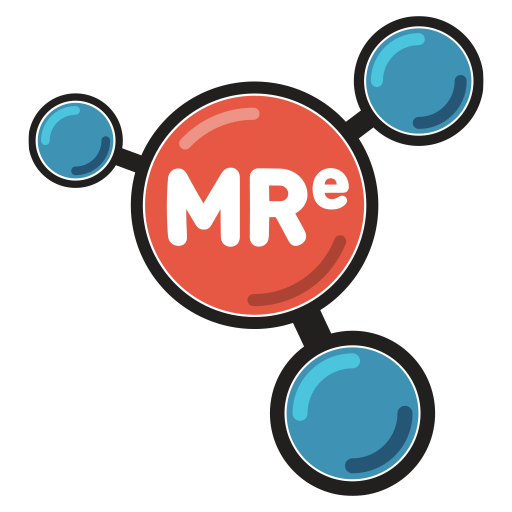

# Mixed Reality Extension SDK

The Mixed Reality Extension SDK lets developers and community members extend
the [AltspaceVR](https://altvr.com/) host app's worlds with multi-user games
and other dynamic experiences.

## Prerequisites
* Install [Node.js 8.12](https://nodejs.org/download/release/v8.12.0/) or
newer, which includes NPM 6.4.1 or newer, from nodejs.org

## Get Started
The easiest way to start with the MRE SDK is to head over to the 
[mixed-reality-extension-sdk-samples](
https://github.com/Microsoft/mixed-reality-extension-sdk-samples) repo, and
build it.

If you want to build the actual SDK itself, jump to [Build and Run section of
this document](#How-to-Build-and-Deploy-the-SDK-functional-tests)

To see the APIs, jump to [SDK documentation](
https://microsoft.github.io/mixed-reality-extension-sdk/)

## Overview
* Written in TypeScript, and built on top of Node.js.
* Utilizes a traditional game engine-style client-server model. All logic runs
on the server, but the client performs the most CPU intensive and
latency-sensitive tasks: animation, collision, rigid body physics simulation,
rendering, and input handling.
* Hides the complexity of multi-user synchronization and prediction, so
developers focus on adding content, not debugging networking code.
* Designed to be secure for users, tolerate high latency, minimize server
activity, and seamlessly blend with the [AltspaceVR](https://altvr.com/)
host app's native content.
* Quick to start: Clone this repo (or the samples repo), deploy an MRE
locally, and see the extension running in the host app within minutes.
* We welcome contributions. Please see [CONTRIBUTING.md](CONTRIBUTING.md)
if you are interested in helping out.

## Features
The SDK enables you to create extensions that can
* Modify the scene graph by loading GLTF assets and scene files, instantiating
primitives or the host app's built-in assets, or programmatically build meshes.
* Create or load keyframe animations.
* Assign rigid body properties, physics forces, collision geometry, and have
objects collide naturally with the host app world, or with other extensions.
* Apply input behaviors and register event handlers on the behaviors.

## Current State
Developer Preview

## Limitations
This is an early developer preview, so there will be rough edges and bugs.

We would love for you to experiment with this SDK by deploying locally or using
[ngrok](https://ngrok.com/) to invite friends to join while you test. However,
during the developer preview phase we don't recommending deploying your app to
cloud services. Until we reach the Feature Complete milestone, and in parallel
with the AltspaceVR integration, there will be occasional breaking changes,
which will require server redeploys.

The SDK also does not have a feature rich set of APIs yet. We have focused on
the networking and synchronization, rather than adding more APIs. Expect this
to improve over time.

The SDK should deploy anywhere Node.js works.

## Goal
We want to deliver a feature-rich set of APIs, enabling creation of high
quality, rich 3d experiences. There are many features we want to add, including
* User masking - hide actors and disable behaviors for a subset of users
* streaming and single-shot sound playback
* Additional input behaviors, such as grab&throw
* 2D UI layout system with standard UI controls
* Particle system
* Realtime lighting
* Rigid body constraints
* Input latency improvements
* Protocol optimization

## Major known Issues
* Rigid body physics state is not synchronized properly between users, so rigid
body experiments should be done alone.
* Text labels always renders on top of all geometry

## Roadmap
We prioritize quality over dates, but a reasonable guess would be
* December 2018 - inital public preview released.
* January/Febraury 2019 - regular beta updates. Occasional breaking changes.
* March 2019 - 1.0 release. At this point we expect the protocol to be stable
enough to not require any server redeploys.
* Ongoing - We expect to continuously roll out new features, well beyond the 
1.0 release.

## How to Build and Deploy the SDK functional tests
From command prompt:
* `git clone http://github.com/microsoft/mixed-reality-extension-sdk`
* `cd mixed-reality-extension-sdk\node`
* `npm install` This will install all dependent packages. (and will do very
little if there are no changes)
* `npm run build` This should not report any errors.
* `npm start` This should print "INF: Multi-peer Adapter listening on..."
* See also: [Using Visual Studio Code instead of command line](
#Using-Visual-Studio-Code)

## Testing an MRE In AltspaceVR
* In [AltspaceVR](https://altvr.com/), go to your personal home
* Make sure you are signed in properly, not a guest
* Activate the Space Editor
* Click Basics group
* Click on SDKApp
* For the URL field, please enter the URL (for example 
`ws://localhost:3901?test=rigid-body-test` for a functional test)
* Enter a session ID (This step will eventually be optional. For now, put 
in any random value)
* Click Confirm
* If the app doesn't seem to load, click on the gear icon next the MRE object
in to the present objects list, and make sure "Is Playing" is checked.

You should now see a functional test load up inside AltspaceVR. 

## Pre-deployed MREs
We have deployed the hello world and functional test MREs to servers in Azure. 
The URLs are
* `ws://mre-hello-world.azurewebsites.net`
* `ws://mre-functional-tests.azurewebsites.net?test=testname` (replace testname 
with gltf-animation-test, input-test, rigid-body-test, text-test, 
primitives-test, look-at-test, or clock-sync-test)

## Using Visual Studio Code
We recommend Visual Studio Code, a lightweight code editor, which is easy to
use and offers full debugging capabilities for Node.js servers. 
* Install from here: [Visual Studio Code](https://code.visualstudio.com/)
* You may want to add the TSLint extension to get style tips - use 
View->Extensions(ctrl+shift+X), search for TSLint, click Install.
* To build: use Tasks->Run Build Task... (ctrl+shift+B), and you can select
`npm: Build` for some or all packages.
* To choose which MRE to launch: go to debugger sidebar: (ctrl+shift+D), and
from the dropdown choose desired MRE.
* To launch the MRE server: use Debug->Start Debugging (F5). To stop the
server: user Debug->Stop Debugging (shift+F5)

## Hosting and Multi-User Testing 
To learn about additional deployment options and multi-user testing in
AltspaceVR, see [DEPLOYING.md](DEPLOYING.md)

## Getting In Touch
To report issues and feature requests: [Github issues page](
https://github.com/microsoft/mixed-reality-extension-sdk/issues).

To chat with the team and other users: join [AltspaceVR SDK Slack channel](
http://sdk-slackin.altvr.com/).

Or attend the biweekly [AltspaceVR developer meetups](
https://account.altvr.com/channels/altspacevr).

---
## Reporting Security Issues
Security issues and bugs should be reported privately, via email, to the Microsoft Security
Response Center (MSRC) at [secure@microsoft.com](mailto:secure@microsoft.com). You should
receive a response within 24 hours. If for some reason you do not, please follow up via
email to ensure we received your original message. Further information, including the
[MSRC PGP](https://technet.microsoft.com/en-us/security/dn606155) key, can be found in
the [Security TechCenter](https://technet.microsoft.com/en-us/security/default).

## License
Code licensed under the [MIT License](https://github.com/Microsoft/mixed-reality-extension-sdk/blob/master/LICENSE.txt).

## Code of Conduct
This project has adopted the [Microsoft Open Source Code of Conduct](https://opensource.microsoft.com/codeofconduct/).
For more information see the [Code of Conduct FAQ](https://opensource.microsoft.com/codeofconduct/faq/) or
contact [opencode@microsoft.com](mailto:opencode@microsoft.com) with any additional questions or comments.
