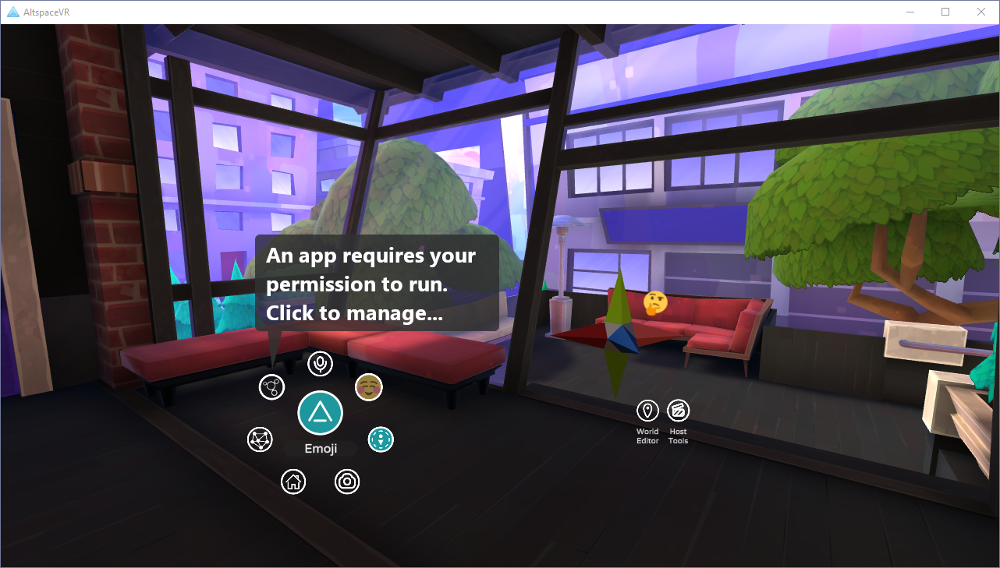

Permissions API
=================

To be a responsible member of the Social MR ecosystem, the MRE SDK has to prioritize the safety of its residents over
the power of this SDK. As such, I propose the addition of a permissions API, so MREs can have more "invasive" features
without compromising user safety and agency.


Permission scope
------------------

When a user approves or denies permission to an MRE, that approval/denial is scoped to the unique combination of
protocol, hostname, and port of the MRE URL, known collectively as the "origin". So when `ws://mres.altvr.com/wearahat`
requests `user-interaction`, that permission is associated with `ws://mres.altvr.com`, and all user decisions apply
equally to new connections to the same server. These user decisions may or may not be persisted indefinitely by the host app.


Features requiring user permission
------------------------------------

If a permission is not requested, it is considered denied.

* `execution` (client only) - Required to connect to an MRE server. Typically granted by default, but can be revoked.
	* Allow: MRE connection can be established
	* Deny: MRE connection will not be established
* `user-tracking` - Grants access to a persistent user identity across sessions. Needed for things like high scores lists.
	* Allow: This user will be uniquely identified to this MRE origin across sessions and instances.
	* Deny: This user will be assigned a new ID every time they connect to MREs from this origin. If the `user-interaction`
		permission is also denied, this client will not join a user to the session at all.
* `user-interaction` - Behaviors, exclusive actors, attachments, and dialogs.
	* Allow: This user can interact with behaviors, exclusively own actors, be a target for attached actors, and can be
		sent dialogs.
	* Deny: Interactions with behaviors will not be sent back to the app server. Attempts to create exclusive actors
		for this user will fail. Actors attached to this user will be considered unattached. Calls to `user.prompt`
		will be rejected. If the `user-tracking` permission is also denied, this client will not join a user to the
		session at all.
* Play sounds and video
* Large assets (hypothetical) - If an MRE wants to load more than some large amount of assets into memory
	(30MB worth of memory? TBD), the client must first approve. This permission might automatically be approved/denied
	by clients on behalf of users based on device capabilities.
* Movement (hypothetical) - The ability to forcibly move a user's avatar and point of view, either smoothly
	or teleported.
* Microphone input (hypothetical) - The ability for users to stream their microphone input into an MRE, for voice
	commands, synthesizers, chat bots, or anything else.


Permission declaration
------------------------

Apps must declare which APIs they will use in advance of any users connecting. This is done via a JSON-formatted
manifest loaded from the app's HTTP root. For example, the manifest for the URL `ws://mres.altvr.com/tests/red` should
be found at `http://mres.altvr.com/tests/red/manifest.json`. Note that this file can be served from the filesystem or
constructed on request.

The manifest must conform to the following JSON schema:

```json
{
	"$schema": "http://json-schema.org/schema#",
	"type": "object",
	"properties": {
		"name": { "type": "string" },
		"author": { "type": "string" },
		"permissions": {
			"type": "array",
			"items": {
				"type": "string",
				"enum": ["user-tracking", "user-interaction"]
			}
		},
		"optionalPermissions": {
			"type": "array",
			"items": {
				"type": "string",
				"enum": ["user-tracking", "user-interaction"]
			}
		}
	}
}
```

Permissioning flow
--------------------

Legend:

* [App] Step executed by MRE developer code
* [SDK] Step executed by MRE SDK
* [Runtime] Step executed in client-side MRE runtime
* [Host] Step executed by host application

Startup:

1. [App] During development, the app developer authors a static manifest file, or uses the WebHost API to generate one.
2. [Runtime|Host] Initializes the MRE API with a permissions manager instance that will receive new permission requests.
	If permission decisions are persistent, load them into memory now. Default provided implementation does not persist.
3. [Host] The host wishes to run an MRE, so creates an IMixedRealityExtensionApp instance and calls Startup().
4. [Runtime] Downloads the manifest from the provided MRE server. If missing, assumes no permissions required.
5. [Runtime] Calls into the permission manager requesting the manifest-listed permissions.
6. [Runtime|Host] Permission manager evaluates the required and optional MRE permissions against the current set of
	grants/denials for the MRE's origin, and determines if any new permission decisions need to be made by the user.
	If so:
	1. [Host] Present the choices to the user by whatever means the host sees fit, persist the decision if desired,
		and report the result to the Runtime. Optional permissions should be presented in such a way as they can be
		granted or denied individually, but required permissions should be decided as a group.
7. [Runtime] Determine if the MRE has sufficient permission to run, i.e. `execution` and all the required permissions
	are granted. If not, abort connecting to the MRE.
8. [Runtime] Startup proceeds like normal, but if a `user-joined` message is sent, the user payload must include
	the IDs of any permissions that were granted to this MRE by this user (other than `execution`, which is implied).


Permissions Manager
---------------------

Host apps must provide hooks for the MRE subsystem to obtain permission from users. This is provided to `MREAPI.InitializeAPI`
as an implementation of `IPermissionManager`, which has the following methods:

* `Task<Permissions> PromptForPermission(...)` - Request permissions from the user, and return a Task that resolves
	with those permissions the user has granted. Takes the following arguments:
	* `string appOrigin` - The origin of the MRE requesting permission, as described above.
	* `string appDisplayName` - A human-readable identifier for the MRE server provided from the manifest.
	* `Permissions permissionsNeeded` - A bitfield of the permissions required to run the app.
	* `Permissions permissionsWanted` - A bitfield of permissions that the app can use, but are not needed to run.
* `Permissions CurrentPermissions(...)` - Returns a bitfield of the currently granted permissions. Takes the following
	arguments:
	* `string appOrigin` - The origin of the MRE for which we want the permission set.

```cs
[Flags]
enum Permissions {
	None = 0,
	Execution = 1,
	UserTracking = 2,
	UserInteraction = 4,
	...
}
```

The default implementation of the permissions manager will also include the following virtual methods:

* `void ReadFromStorage()` - Populate the in-memory permission database from offline storage.
* `void WriteToStorage()` - Write the "remembered" portions of the in-memory permission database to offline storage.


UI Mockups
============

This is what an MRE management interface could look like in AltspaceVR. When any MRE is in a space, a UI icon appears
in your radial menu. During startup, you might get a prompt for permissions:



Clicking the prompt or the icon brings up the Requests window:


This window is paginated, one page per MRE that requires permissions. Each permission has a checkbox next to it:
required permissions are checked and disabled, and optional permissions are checked or not based on app origin decision
history and settings.


Old stuff
===========


Methods for acquiring permission
----------------------------------

1. **Request permission for a feature the first time it is used**
	1. The application code makes an async call to an API that requires user permission.
	2. The SDK detects that this is the first time that API is used for this user, so it saves the API call request
		internally and sends a permission request to the user.
	3. The user's client will reply	with an approved or denied message. If approved, the original API call is executed.
		If not, handle the rejection.
2. **Request permission for a set of features explicitly**
	1. The application code uses a permissions API to set the permission requirements for the app.
	2. All current and late-joining users are sent a message asking for any permissions not already granted or denied.
	3. Each user will reply with an approved or denied message. If approved, the approval is saved, and all future API
		requests that require that permission will be processed for this user. If denied, handle the rejection.
3. **Establish permissions during initialization**
	1. Provide a list of permissions required by an app during app setup.
	2. During connection handshake, the list of required permissions will be sent to the client.
	3. If the client approves, initialization proceeds like normal. If not, handle the rejection.


Methods for handling permission rejection
-------------------------------------------

1. Revoke access to the denied APIs for the set of denying users.
2. All users must approve of all permissions; users that do not approve immediately leave the MRE.
3. All clients must approve of all permissions; clients that do not approve immediately disconnect from the MRE server.


Methods for presenting permission requests to users
-----------------------------------------------------

1. Dialogs
2. Settings menu
