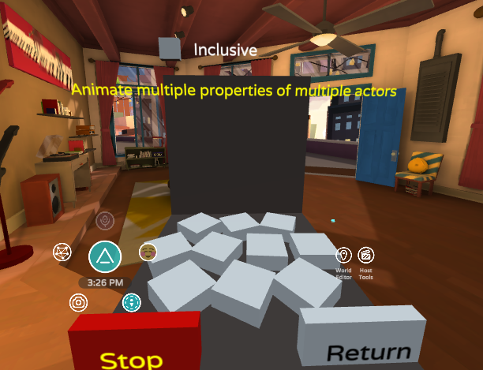
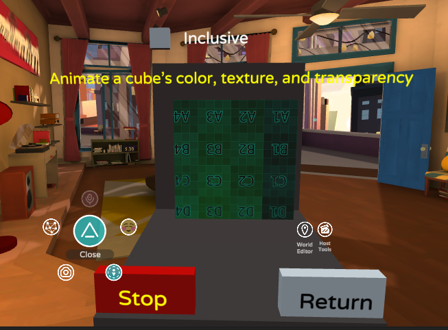
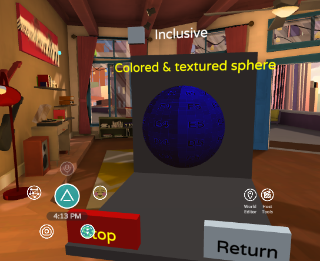
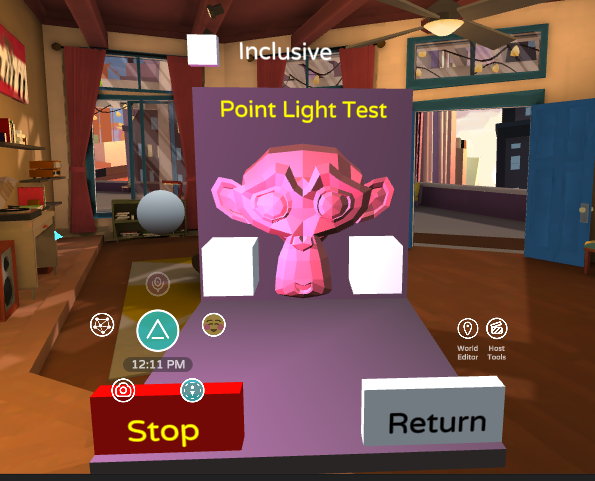

# Functional Tests

## Actor Attachment

Description:
*  "Actors attaching to avatar points"

How to Run:
* On start, a grey, oblong box attaches to the avatar of the user who started the test
* The current attachment point is displayed above the grey box in the center of the test setup
* Clicking the grey box changes the avatar attachment point
* Clicking the box on the left changes the attachment strategy:
	* When the box is Red, the attachment box is destroyed, then a new one is created and attached to the new point
	* When the box is Blue, the attachment box is re-parented to a new attachment point without being destroyed

Pass when: 
* The attachment box is attached with its center directly over the body part displayed in text for every combination of settings

Fail when: 
* Any combination of settings yields an incorrect transformation

Notes:
* Selfie camera or a friend is necessary for verifying some of these locations

*As of 07/08, Reparenting the box instead of re-creating it yields the incorrect transformation*

## Actor Spam

Description:
* "Spawn lots of actors all at once"

How to Run:
* On start, 4 button cubes appear, prompting the tester to spawn 25, 50, 100, or 200 actors
* Clicking a cube creates one or more lines of actors represented by untextured sphere meshes
* Continuing to click on button cubes destroys the current set of actors and creates a new one

Pass when:
* The correct number of actors appear within a reasonable (TBD?) amount of time TB: I think that we need to determine the max load time acceptable on Quest, as I think that is the low bar at the moment.  That may change as other platforms come online like HL2 and future stuff

Fail when:
* Incorrect number of actors spawn
* Excessive lag or instability during or after actor spawn

## Altspace Library

Description:
* "Altspace kit objects, teleporter to the Campfire";

How to test:
* On start, a number of sample kit objects should spawn as the screenshot above shows
* Hovering over each item should change the yellow displayed text to the name of that object
Clicking the teleporter should teleport you to the campfire.

Pass when:
* The Kit objects correctly load, in the proper transforms, and the items function as appropriate

Fail when:
* Objects load in the wrong positions, orientations, or with missing textures.
			
## Altspace Video

Description:
* "Play a couple youtube videos. Click to cycle."

How to test:
* On Start, a youtube movie of dogs playing in the snow should start playing
* On clicking the button sphere in the bottom left of the test, the movie should change to a different dog video
* On clicking the sphere a second time, the video player should disappear
* On clicking the sphere once more, the sequence should start again from the first video

Pass when:
* The movie plays automatically when starting
* The movie switches when clicking the button sphere the first time
* The movie player is destroyed when clicking the button sphere the second time
* The movie player re-appears when clicking the button sphere a third time

Fail when:
* Video does not play in its entirety
* Video plays without sound
* Lag or instability during video playback

## Animation Blend

Description:
* "Two animations targeting one object should cancel."

How to test:
* Just start the test and observe:

Pass when:
* The left and rightmost spheres alternate animating up and down
* The center sphere remains still as the blended sum of two opposing animations

Fail when:
* Incorrect position of any sphere
* Lag or instability during the test

## Dynamic Animation

 Description
* "Ball should bounce between boxes as they are moved";

How to test:
* On start, 4 boxes and 1 sphere spawn
* The sphere animates continuously from one of the outermost boxes to the next
* The tester may click and drag the outermost boxes to change the sphere's animation targets
* The tester may click and drag the innermost box the move the position of the rest of the shapes

Pass when:
* The sphere animates correctly between all three boxes continuously
* The control boxes may all be moved, and the sphere correctly updates its animation targets

## Relative Animation

Description:
* "Should spin smoothly"

How to test:
* Just start test and observe the spinning box

Pass when:
* The box smoothly rotates

## Animation Scale

 Description
* "Animate multiple properties of multiple actors"

How to test:
* Just start test and observe the jumping, spinning, and squash/stretching cubes

Pass when:
* The cubes animate correctly

Fail when:
* Cubes animate out of synch

## Animation Scale

    

Description:
* "Tweak an animation"

How to test:
* On start, two identical clock faces and a set of controls spawn
* Clicking the arrow buttons next to the "Playing:" label starts and stops both animations
* The "Time:" label increases as the animation plays. Clicking the arrows jumps the animations forward and backward
* Clicking the arrows next to the "Speed:" label increases and decreases the speed of the animations
* Clicking the arrows next to the "Wrap:" label changes the wrap behavior between loop, ping-pong, and once

Pass when:
* The animations play correctly according to the options selected

Fail when:
* The animations play out of synch

## Animation Scale

    
 
Description:
* "Lerping scale and rotation"

How to test:
* Just start and observe

Pass when:
* Cube interpolates to various rotations and scales

## Animation Scale

    

Description:
* "Unlit colored & textured sphere"

How to test:
* Start and observe the texture applied to the sphere

Pass when:
* The sphere has the correct texture applied

## Asset Mutability

    

 Description
* "Animate a cube's color, texture, and transparency";

How to test:
* Start and observe

Pass when:
* The texture animates in size, hue, and transparency

## Asset Preload

    ''

 Description
* "Two meshes juggle their materials and textures. Click to advance."

How to test:
* On Start, two meshes with different materials and textures should load
* Each successive click tests Swapping and Clearing Materials and Textures
* Clicking again after all materials are unloaded re-initializes the scene

Pass when:
* Materials and Textures both swap and clear successfully
* The textures and materials re-instantiate after the prefabs are destroyed

## Asset Unload 

    

 Description
* "Unload assets one at a time"

How to test:
* On start, a textured and colored sphere appears
* Clicking once removes the texture
* Clicking again removes the color
* Clicking a third time removes the model, leaving just the collider
* Clicking once more resets the scene

Pass when:
* The materials unload and reload correctly

## Button Targetting

    

Description:
* "Draw on the surface to place red ink";

How to test:
* Move your cursor over the whiteboard with and without holding the action button

Pass when:
* Black dots appear as your cursor moves over the whiteboard, but disappear after a few seconds
* Red dots appear and remain while moving your cursor over the whiteboard with the action button pressed
* Clicking the button cube erases the red dots

## Clock Sync

    

Description: 
* "Digital clock face from animating text strips"

How to test:
* Start test and observe the strips of numbers animating to simulate a counting clock

Pass when:
* The text strips animate smoothly in sync to the time they represent

## Collision Layer

    

Description:
* "Observe different collision layer interactions"

How to test:
* Start test and observe the color of the static cubes against the dynamic spheres

Pass when:
* Default and navigation layers collide with each other
* Hologram layers only collide with each other
* UI layers only collide with each other

## Failure

     

Description:
* "Fails";

How to test:
* Just start and observe thrown exception

Pass when:
* "Error: Throwing an exception" appears, and the test reports a failure after clicking Return

## Actor Sync

     

Description:
* "Text should be visible"

How to test:
* Just start and observe

Pass when:
* The text "Peek-a-boo!" is visible, indicating a successful transformation edit post-load of a GLTF actor

## GLTF Concurrency

     

Description:
*  "Cesium man, a bottle, and maybe a gearbox."

How to test:
* Start and wait for the models to load

Pass when:
* The scene above is recreated within ~10 seconds of the start of the test

Notes:
* Why only "Maybe" a gearbox? TB: It is higher than the vertex limit in Altspace so it won't finish loading there.

## GLTF Generation

     
 
Description:
* "A textured sphere"

How to test:
* Start and observe the various models with the alpha-blended texture applied

Pass when:
* The above scene loads and renders

## Grab

     

Description:
* "Different grabbable items."

How to test:
* On start, the monkey head is grabbable, grab and drag the monkey to verify
* Click the monkey head to disable the grabbable flag, verify by trying to drag it
* Click the monkey head again to re-enable the grabbable flag, verify by dragging it.

Pass when:
* The monkey head is grabbable, and the grabbable flag correctly enables and disables
   
   
## Grid
 

Description
* "Click balls to realign grid"

How to test:
* Click each ball to observe the grid realigning

Pass when:
* Each ball correctly realigns the grid
    
    
## Input
 

Description:
* "Hover, click, and unhover"

How to test:
* Hover over the monkey head and observe the change in size and text to "Please Click"
* Click the monkey head and observe the half-turn and the change in text to "Please Unhover"
* Unhover and observe the change in size

Pass when:
* The above steps function correctly
   
   
## Library Fail
 

Description:
* "Fails"

How to test:
* Start and observe error message

Pass when:
* The above error is thrown
    
## Light
 

Description:
* "Different types of lights"

How to test:
* Start and observe the lighting effects cast by the sphere against the monkey head

Pass when:
* Each lighting mode renders correctly
    
## Livestream Scale
 

Description:
* "Tests livestream video"

How to test:
* Start and observe the livestreaming content

Pass when:
* The video plays, and the controls function
    
## Look At
 

Description
* "No swivel, XY swivel, Y swivel"

How to test:
* Start and walk around, observe the monkey head following your avatar

Pass when:
* The monkey head looks at the proper avatar correctly according to the swivel mode

Notes
* No indication of current swivel mode!  TB: There is a modes array in the test that we could expose as strings on a label in the test
    
## Physics Bounce
 

Description:
* "Balls and boxes hit the ground and bounce."

How to test:
* Start and observe boxes

Pass when:
* Boxes fall and bounce
    
## Physics Friction Scale
 

Description:
* "Boxes slide with different frictions."

How to test:
* Start and observe sliding boxes

Pass when:
* Boxes slide with different levels of friction
   
## Physics Free Fall
  

Description:
* TBD

How to test:
* Start and observe sphere

Pass when:
* Sphere falls to the floor
    
## Physics Collision

Description:
* TBD

How to test:
* Start and observe the ball receive a force and observe it bouncing around the scene

Pass when:
* B.0's sphere has a bounciness of 0 (no bouncing) and b.8's has a bounciness of .8 (small bounces)
 Notes:
* Raise the test environment up by a meter or two to better observe the difference in bounciness
    
## Physics Head Collision
TBD
    
## Physics Pile Scale
Description:
* TBD
How to test:
* Start and observe the piling behavior of the boxes:
* For v1, boxes pile up till there are 50, after which the oldest box gets deleted
* For v2, boxes have a 100(Note: should be shorter? TB: If this is too long, we can make it shorter then.) second timeout and a 70 item limit, effectively making this an identical test to v1?
* For v3, some boxes are spawned in a different color, these receive a force shortly after spawning
    
## Animation Scale
 

Description:
* "Balls trickle through the plinko board.\nClick to disable a peg."
How to test:
* Start and observe the plinko board
* Click to disable and re-enable collision on pegs
Passes when:
* Balls collide with enabled pegs and pass through disabled ones
    
## Animation Scale
 

Description:
* "Stack of rigid body boxes."

How to test:
* Start  and observe. Creates a stack of 2 or 4 rigid body boxes, either small or large sized, and either single owner or mixed ownership

Passes when:
* Correct number of boxes spawn and stably stack
* For tests without the "mix" in the title, only the initiator of the test may interact with the boxes
* For tests with "mix" in the title, anyone in the room may interact
    
## Primitives
 

 Description
* "A variety of primitives";

How to test:
* Start and hover over the various primitives, observe the yellow text changing

Passes when:
* The name of every primitive in the scene is displayed when the tester hovers over them
    
## Prompt
 

Description:
* "Display a text prompt to a user";

How to test:
* Click the "Click for prompt" and "Click for message" floating texts and observe the popups
* Enter a response and click OK to the prompt and observe the answer appear below "Click for prompt", or click cancel
* Click OK or Cancel to the message and observe the choice reflected below "Click for message"

Pass when:
* The prompts and messages appear, and the user's response is correctly reflected in the test scene.
    
## Reparent
 

Description:
* "Sphere should be jumping left, center, and right"

How to test:
* Start and observe the sphere changing positions

Pass when:
* Sphere switches between three different positions (How do we know which they're supposed to be?)  TB: We could make the parent that they are reparenting to have a small visible sphere or something like that to know where they should jump.
    
## Sound
 

Description:
* "Sounds. Click buttons to toggle";

How to test:
* Click the three different spheres and observe the sounds

Pass when:
* Clicking the leftmost sphere start and stops music
* Clicking the center sphere just plays a one-shot sound
* Clicking the rightmost sphere starts and stops a continuous sound in time with the animation of spinning spheres
    
## Sound Sync
 

Description:
* "Tests Prerecorded sound playback synchronization"

How to test:
* Start and observe the sound of a voice counting from one to twenty

Passes when:
* The sound loads and plays, and the controls function as indicated
    
## Server Stats
 

Description:
* "Shows the current server stats"

How to test:
* Start and observe the stats of the current server:

Passes when:
* The server's stats are displayed

    
## Text Styles
 

Description:
* "Text cycling their options"

How to test:
* Start and observe the various texts and their properties cycling

Pass when:
* All floating texts change their properties according to what they display
    
## Transform
 

Description:
* "Four half-meter cubes in a row"

How to test:
* Start and observe 4 cubes laid out as above

Pass when:
* The above scene is recreated
    
## User Mask
 

Description:
* "Click to change teams"

How to test:
* Click the Red box or Blue sphere to change your displayed team

Pass when:
* The colored shape reflects the current user's team assignment
* Clicking the colored shape changed the shape displayed as well as the user's displayed team assignment
    
## User Info
 

Description:
* "Lists user info"

How to test:
* Launch and observe the user info displayed

Passes when:
* The displayed info is correct
    
## Video Play
 

Description:
* "Play a couple youtube videos. Click to cycle."

How to test:
* Launch and observe video
* Click sphere to cycle options on video playback
 
 Passes when
* Video acts according to the displayed text as the user cycles through options by clicking on the sphere
    
## Video Sync
 

Description:
* "Tests Prerecorded video sync from an internet source";

How to test:
* Launch and observe playing video

Passes when:
* The video plays in synch with the audio, and the controls all function properly
    
## Visibility
 

Description:
* "Two rows of appearing cubes"

How to test:
* Launch and observe the marching line of cubes

Passes when:
* The two lines of cubes slowly fill in left to right, then disappears
